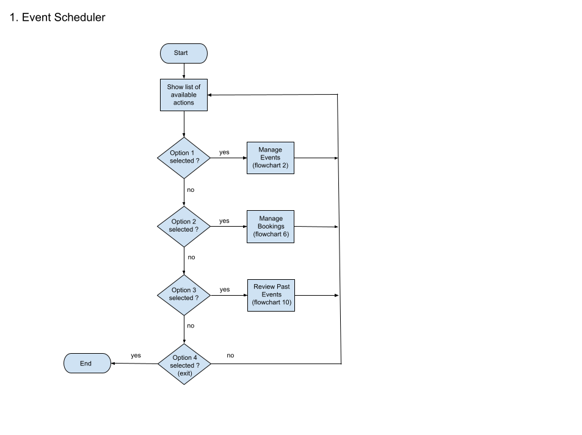
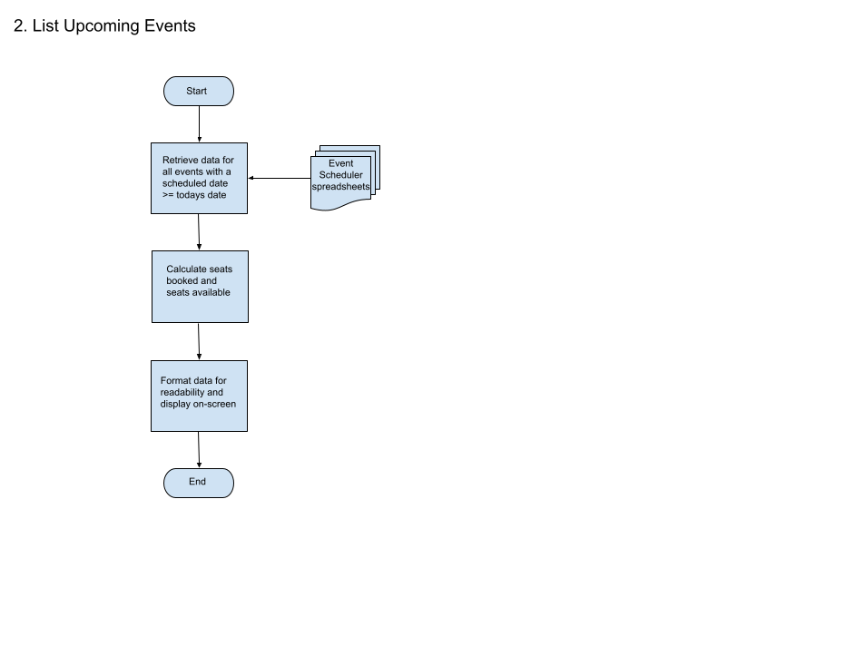
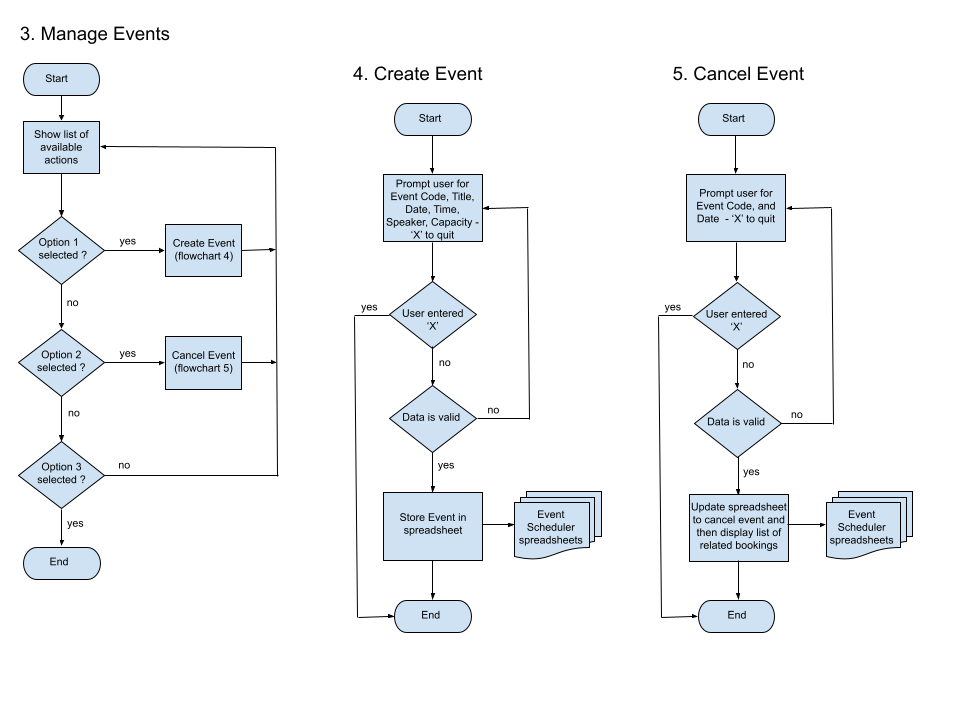
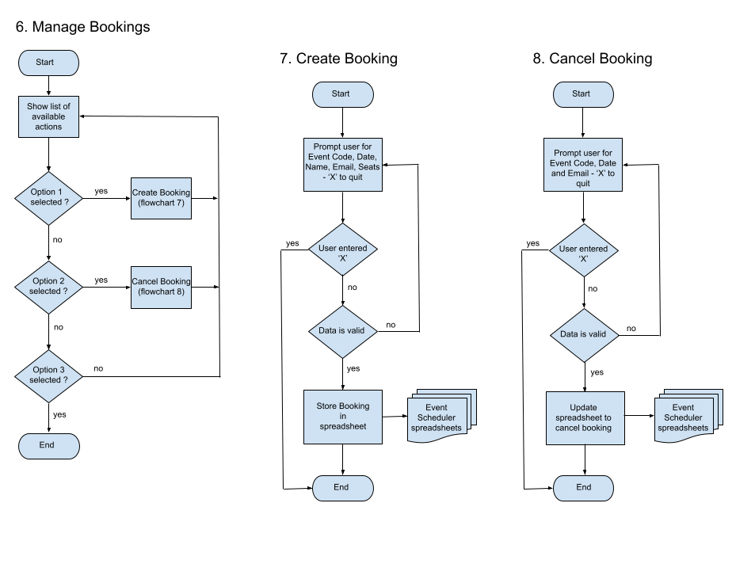
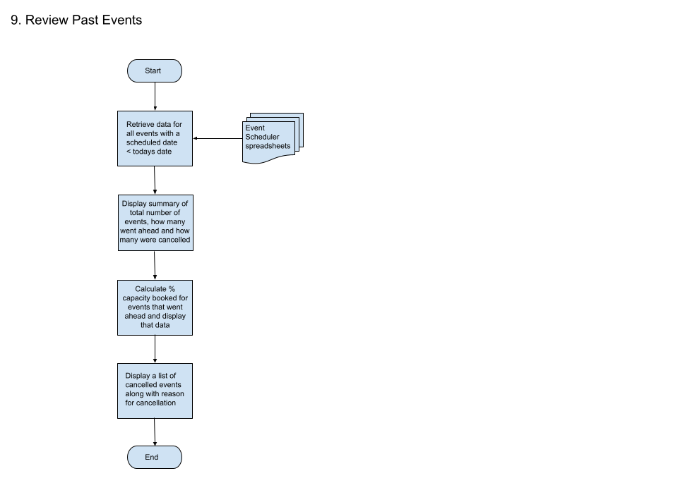

<h1 align="center">Event Scheduler</h1>

[View the live project here](https:// to be written)

To be written

## Index – Table of Contents
* [User Experience (UX)](#user-experience-ux) 
* [Features](#features)
* [Design](#design)
* [Technologies Used](#technologies-used)
* [Testing](#testing)
* [Deployment](#deployment)
* [Credits](#credits)

## User Experience (UX)

-   ### User stories - as a user I want to be able to :

1. To be written

## Features

### Existing Features

-   __F01 To be written__
    - To be written

      

- __How these features support the User Stories__

    - The User Stories in the [User Experience (UX)](#user-experience-ux) part of this document are numbered ??????.  The existing features are listed above as F01 to F?????.  Below is a traceability matrix cross-referencing the user stories with the features, illustrating which features support which stories :

        

### Features which could be implemented in the future

- __To be written__

## Design
- REVIEW RULES AROUNT >= <=> dates and - explain business rules and check code and diagrams match
-   ### Flow Charts
     
     
     
     
     
    
## Technologies Used

### Languages Used

-   [?????](to be written)

### Frameworks, Libraries & Programs Used

-   [Google Spreadsheets](https://en.wikipedia.org/wiki/Google_Sheets) used as the external data store for the Events and Bookings data used by the project.
-   [Google Drive API](https://developers.google.com/drive/api/v3/about-sdk) used to generate credentials used in the project to securely access the Google Spreadsheet. 
-   [Google Sheets API](https://developers.google.com/sheets/api) used to support interactions (e.g. read/write functionality) between the code and data stored in the Google Spreadsheet.
-   [gspread](https://docs.gspread.org/en/latest/) Python API for Google Sheets
-   [Google Auth](https://google-auth.readthedocs.io/en/master/) Google authentication library for Python required to use the credentials generated for Google Drive API
-   [Google Drawings](https://en.wikipedia.org/wiki/Google_Drawings) used to create the flowcharts outlining the functionality of the project.
-   [Git:](https://git-scm.com/) was used for version control by utilising the Gitpod terminal to commit to Git and Push to GitHub.
-   [GitHub:](https://github.com/) is used as the respository for the projects code after being pushed from Git.

## Testing

### Validator Testing 

- [????](to be written)

    - result for ?????
      
    
### Test Cases and Results

- The below table details the test cases that were used, the results and a cross-reference to the Feature ID that each test case exercised (click to open image):

  

    
Test Cases

    
  

  

### Known bugs

- to be written

## Deployment

### How this site was deployed - to be written

- to be written

  The live link can be found here - [???????](to be written) 

### How to clone the repository - to be written

- Go to the https://github.com/elainebroche-dev/ms2-anagram repository on GitHub 
- Click the "Code" button to the right of the screen, click HTTPs and copy the link there
- Open a GitBash terminal and navigate to the directory where you want to locate the clone
- On the command line, type "git clone" then paste in the copied url and press the Enter key to begin the clone process
- Changes made to the local clone can be pushed back to the repository using the following commands :

  - git add *filenames*  (or "." to add all changed files)
  - git commit -m *"text message describing changes"*
  - git push

- N.B. Any changes pushed to the master branch will take effect on the live project

## Credits 

### Content 
- (https://www.geeksforgeeks.org/clear-screen-python/) code to clear the screen - to be written

### Code 
- To be written
- (https://stackoverflow.com/questions/15509345/extracting-double-digit-months-and-days-from-a-python-date) code to return 2 digit month/day - to be written
- (https://www.cyberciti.biz/faq/howto-get-current-date-time-in-python/) - might use this to help format
- (https://docs.python.org/3/library/datetime.html) - help with dates
- (https://docs.gspread.org/en/latest/user-guide.html#getting-all-values-from-a-worksheet-as-a-list-of-lists) - doc on api
- (https://stackoverflow.com/questions/4174941/how-to-sort-a-list-of-lists-by-a-specific-index-of-the-inner-list/4174955) - information on sort using lambda
- (https://stackoverflow.com/questions/61285626/print-list-of-lists-in-neat-columns-table) - code to format list for printing

### Media 
- To be written

### Acknowledgments

- To be written