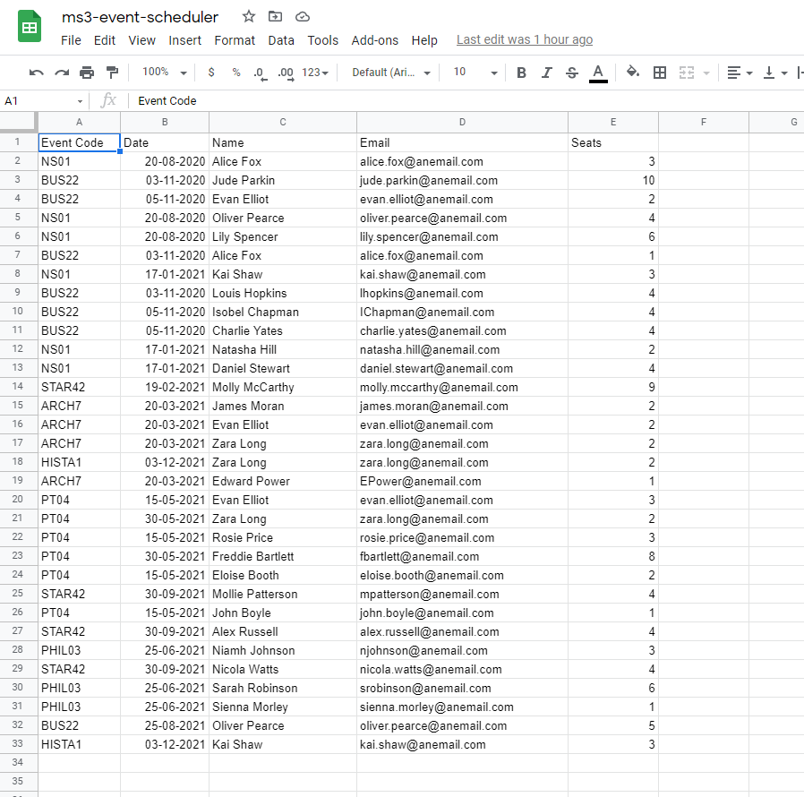

<h1 align="center">Event Scheduler</h1>

[View the live project here - to be written]()

[Access the spreadsheet data here](https://docs.google.com/spreadsheets/d/1-dS9LBZ54kH8T2ngIkTrf40maT9B2i80f6KnuEASd94/edit?usp=sharing)

Event Scheduler is a command line application to manage data relating to events such as talks/lectures and bookings for those events.

The user can interact with the application to view upcoming events and bookings, review past events and see how popular they were (% seats booked), add new events, cancel upcoming events, create and delete bookings linked to upcoming events. 

The event and booking data is stored in an external Google Spreadsheet.

## Index – Table of Contents
* [User Experience (UX)](#user-experience-ux) 
* [Features](#features)
* [Design](#design)
* [Technologies Used](#technologies-used)
* [Testing](#testing)
* [Deployment](#deployment)
* [Credits](#credits)

## User Experience (UX)

-   ### User stories - as a user I want to be able to :

  1. Easily navigate between the different functions availabe in the application.
  2. View information on upcoming scheduled events in the events spreadsheet - event ID code, title, scheduled date, host and number of seats available to book
  3. Use the application to book new events and have these stored in the events spreadsheet.  
  4. Cancel events and log a reason for cancellation in the events spreadsheet.
  5. Automatically remove all bookings linked to a cancelled event from the bookings spreadsheet and return a list on screen of those details so that attendees can be notified.
  6. View information on bookings for upcoming scheduled events - event ID code, scheduled date, attendee name, attendee email, number of seats booked
  7. Add a new booking for an upcoming event.
  8. Cancel a booking in the bookings spreadsheet.
  9. Review and analyse data for past events, this information should include :
      - details on cancelled events including the reason given for cancellation
      - details on events that went ahead including the number of seats that were available and % seats booked 
      - a total number of cancelled events
      - a total number of events that went ahead
  10. Clearly understand how to interact with the application and get feedback on updates to the underlying data.
  

## Features

### Existing Features

how do I want dates to work ? - this needs to go into the readme to clarify
upcoming should show today and the future for both bookings and events
Can cancel events or bookings for >= today
Can create events or bookings for >= today
review events should show data < todays date

-   __F01 To be written__
    - To be written

      

-   __F02 To be written__
    - To be written

      

-   __F03 To be written__
    - To be written

      

-   __F04 To be written__
    - To be written

      

-   __F05 To be written__
    - To be written

      
  
-   __F06 To be written__
    - To be written

      

-   __F07 To be written__
    - To be written

      

-   __F08 To be written__
    - To be written

      

-   __F09 To be written__
    - To be written

      

-   __F10 To be written__
    - To be written

      

-   __F11 To be written__
    - To be written

      

- __How these features support the User Stories__

    - The User Stories in the [User Experience (UX)](#user-experience-ux) part of this document are numbered 1 to 10.  The existing features are listed above as F01 to F11.  Below is a traceability matrix cross-referencing the user stories with the features, illustrating which features support which stories :

        

### Features which could be implemented in the future

- __Appropriate UI__

  As this application uses the command line interface it is not very user friendly for a human end-user.  An obvious future feature of this application would be to build a better user-interace layer using HTML/CSS and possibly Javascript to make it much more intuititve to use.

- __Extended Data Model__

  The data model representing the Events and Bookings is very simplistic in what data elements it stores.  This could be extended to store additional data with more complex data relationship rules.  The data model and code could also be re-structured to use a better Object Oriented approach, where Events and Bookings could be handled as Object types with methods and attributes.

- __Extended Data Analysis__

  The Review Past Events feature of the application gives a breakdown of cancelled events vs events that weren't cancelled and shows % seats booked for those that went ahead.  Analysis of the data could be extended to find other information from the data, such as how frequently are certain events cancelled due to lack of bookings, which courses are most popular etc. and then this information could help the users plan ahead when trying to schedule events.  This type of information could also potentially be used to automate some tasks - e.g. automatically send an administrator an email highlighting a particular event has below a certain threshold of bookings coming up to it's scheduled date, so that the administrator has time to take action - e.g. send out a marketing email to draw attention to the event.

## Design

-   ### Flow Charts
    The diagrams below outline the high level flow of control within the application :

    

       
Diagrams

       
       
       
       
       
       
    

    
## Technologies Used

### Languages Used

-   [Python 3.8.10](https://www.python.org/)

### Frameworks, Libraries & Programs Used

-   [Google Spreadsheets:](https://en.wikipedia.org/wiki/Google_Sheets) used as the external data store for the Events and Bookings data used by the project.
-   [Google Drive API:](https://developers.google.com/drive/api/v3/about-sdk) used to generate credentials used in the project to securely access the Google Spreadsheet. 
-   [Google Sheets API:](https://developers.google.com/sheets/api) used to support interactions (e.g. read/write functionality) between the code and data stored in the Google Spreadsheet.
-   [gspread:](https://docs.gspread.org/en/latest/) Python API for Google Sheets
-   [Google Auth:](https://google-auth.readthedocs.io/en/master/) Google authentication library for Python required to use the credentials generated for Google Drive API
-   [Google Drawings](https://en.wikipedia.org/wiki/Google_Drawings) used to create the flowcharts outlining the functionality of the project.
-   [Git:](https://git-scm.com/) was used for version control by utilising the Gitpod terminal to commit to Git and Push to GitHub.
-   [GitHub:](https://github.com/) is used as the respository for the projects code after being pushed from Git.
-   [Heroku:](https://heroku.com) is used to deploy the application and provides an enviroment in which the code can execute

## Testing

### Validator Testing

- [Python Validator](http://pep8online.com/)

    - result for `run.py`

      

### Test Cases and Results

- The below table details the test cases that were used, the results and a cross-reference to the Feature ID that each test case exercised (click to open image):

  

    
Test Cases

    
  

  

### Known bugs

- Problem with clear screen.

    Originally the clear function was implemented using the below code snippet :
        
          if name == 'nt':
            _ = system('cls')
          else:
            _ = system('clear')

    the reference for this code is: [Clear Screen](https://www.geeksforgeeks.org/clear-screen-python/).  

    This worked fine when testing within the gitpod environment, but did not work when the application was deployed to Heroku.  No error messages or warnings were displayed when the application was run on the Heroku platform, the clear screen simply did not do anything.
    To solve this problem I replaced the above code with this code :

        print('\033c')

    the reference for this code is: [Clear Screen - ASCII sequence](https://stackoverflow.com/questions/2084508/clear-terminal-in-python/2084521).
    This appears to to work when tested in the gitpod environment and in the version deployed to Heroku.

## Deployment

### How to clone the GitHub repository
  
  

    
Steps to create a local clone

  
   - Go to the https://github.com/elainebroche-dev/ms3-event-scheduler repository on GitHub 
   - Click the "Code" button to the right of the screen, click HTTPs and copy the link there
   - Open a GitBash terminal and navigate to the directory where you want to locate the clone
   - On the command line, type "git clone" then paste in the copied url and press the Enter key to begin the clone process
   - Changes made to the local clone can be pushed back to the repository using the following commands :

        - git add *filenames*  (or "." to add all changed files)
        - git commit -m *"text message describing changes"*
        - git push
      
   - N.B. Any changes pushed to the master branch will take effect on the live project because automatic deployments are enabled in Heroku for this project.
   

    

### How this site was deployed to Heroku - to be written
   
  

    
Steps to deploy

  - to be written
  - N.B. Any data changes made through the use of the application will take effect in the ms3-event-scheduler Google spreadsheet located here :  https://docs.google.com/spreadsheets/d/1-dS9LBZ54kH8T2ngIkTrf40maT9B2i80f6KnuEASd94/edit?usp=sharing 
  

    

### How to connect to a different data source - to be written
   
  

    
Steps to connect

  - to be written
  

  The live link can be found here - [???????](to be written) 

  notes on deployment :
  usual git stuff needed

The Code Institute Python Essentials template was used to build the project Gitpod workspace.  This template
includes files and code to support deployment in a mock terminal on a web page.

A newline character was added to the end of each string used with the input function because due to how the
software to create the mock terminal works, the newline is needed so that the text for the input request shows
on screen.

The requirements.txt file in the project was updated to include details on the project dependencies.
Steps to do this are :

1. Enter the following command at the terminal prompt : 'pip3 freeze > requirements.txt'
2. Commit resulting changes to requirements.txt and push to github

Login to your Heroku account.  If you don't have one, create one on www.heroku.com.  Enter your name, email and 'Student' can be selected for the Role value.  Choose a value for Country based on your location and select "Python" as the Primary development language.  

Once the Create button has been clicked, Heroku will send a confirmation email, to complete account creation click on
the link in this email.

Heroku will then bring you to a page to set up your password and log in.

Accept the Heroku terms of service and then you will be brought to the dashboard for your account.

If this is a new account an icon will be visible on screen to allow you to Create an app, alternatively you can find a link to this function under the New dropdown menu at the top right of the screen.

From the Heroku dashboard, click the Create new app button.

On the Create New App page, enter a unique name for the application and select your region.  Then click Create app.

You will then be brought to the application configuration page for your new app.  The important tabs on this page are Deploy and Settings.

Click on the Settings tab and then scroll down to the Config Vars section to set up the private Environment Variables for the application - i.e. the credentials used by our application to access the spreadsheet data.

*** Be careful here !!! we need details on how exactly to create the creds.json file as this is not something that is available
to someone other than ourselves - so need to back up here on this *****
Click on Reveal Config Vars.  In the field for key enter 'CREDS' and paste the entire contents of the creds.json file into the VALUE field and click ADD

Next, scroll down the Settings page to Buildpacks.  Click Add buildpack, select Python from the pop up window and click on Save changes.  Click Add buildpack again, select Node.js from the pop up window and click on Save changes.  It is important that the buildpacks are listed on the page in the order shown in the diagram.

Now go to the Deploy tab for the application configuration.

Select GitHub as the Deployment Method and if prompted, confirm that you want to connect to GitHub.  Enter the name of the github
repository (ms3-event-scheduler) and click on Connect to link up the Heroku app to the GitHub repository code.

Scroll down the page and decide if you want to Automatically Deploy each time changes are pushed to GitHub, or Manually deploy - for this project.
Manual Deploy was selected and then Deploy Branch clicked. Log messages displayed to show the build messages.

Click on View to launch the application.
Address for this deployed app is ()

redeploy from the deploy page after each push

### How to clone the repository - to be written

- Go to the https://github.com/elainebroche-dev/ms2-anagram repository on GitHub 
- Click the "Code" button to the right of the screen, click HTTPs and copy the link there
- Open a GitBash terminal and navigate to the directory where you want to locate the clone
- On the command line, type "git clone" then paste in the copied url and press the Enter key to begin the clone process
- Changes made to the local clone can be pushed back to the repository using the following commands :

  - git add *filenames*  (or "." to add all changed files)
  - git commit -m *"text message describing changes"*
  - git push

- N.B. Any changes pushed to the master branch will take effect on the live project

## Credits 

### Content 
- The Google spreadsheet (ms2-event-scheduler) that the application uses has the following fictious initial data which was set up manually :

   

     
Events Sheet

     
   

   

     
Bookings Sheet

     
   

    

### Code 
- Code on how to clear the screen came from information on this website : [Clear Screen](https://www.geeksforgeeks.org/clear-screen-python/)
- Code to clear screen using an ASCII escape sequence came from this website: [Clear ASCII Escape](https://stackoverflow.com/questions/2084508/clear-terminal-in-python/2084521) 
- Code on extracting 2 digt months and days from a date came from information on this website : [2 digit month and day](https://stackoverflow.com/questions/15509345/extracting-double-digit-months-and-days-from-a-python-date)
- Code to format dates was based on information from this website : [Date Formatting](https://www.cyberciti.biz/faq/howto-get-current-date-time-in-python/)
- Additional information on date manipulation came from this website : [Date handling](https://docs.python.org/3/library/datetime.html)
- Information on using the gspread API came from this website : [gspread API](https://docs.gspread.org/en/latest/user-guide.html#getting-all-values-from-a-worksheet-as-a-list-of-lists) 
- Code using a lambda function to sort came from information on this website: [Lambda Sort](https://stackoverflow.com/questions/4174941/how-to-sort-a-list-of-lists-by-a-specific-index-of-the-inner-list/4174955) 
- Code to format data for printing in a table on screen came from information on this website : [Table Formatting](https://stackoverflow.com/questions/61285626/print-list-of-lists-in-neat-columns-table) 
- Code on how to use gpspread API to delete rows came from this website : [gspread Delete](https://docs.gspread.org/en/latest/api.html?highlight=delete%20rows#gspread.models.Worksheet.delete_rows) 
- Information on how to use 'in' came from this website : [In](https://stackoverflow.com/questions/22304500/multiple-or-condition-in-python) 
- Code to help validate data values came from information on this website: [Date Validation](https://stackoverflow.com/questions/47547403/regular-expression-for-mm-dd-yy-date-format-not-finding-any-match-in-python)
- Code to use an RE to validate format of email address came from information on this website : [Email RE](https://www.geeksforgeeks.org/check-if-email-address-valid-or-not-in-python/)
- Code to extend a list came from information on this website: [Extend List](https://www.datacamp.com/community/tutorials/python-list-methods?utm_source=adwords_ppc&utm_campaignid=898687156&utm_adgroupid=48947256715&utm_device=c&utm_keyword=&utm_matchtype=b&utm_network=g&utm_adpostion=&utm_creative=229765585183&utm_targetid=dsa-429603003980&utm_loc_interest_ms=&utm_loc_physical_ms=9047196&gclid=CjwKCAjw_o-HBhAsEiwANqYhp7Kw0hp2dNCHcgDIIW4aLzI7CKRIUFqkaZSPoqyrk2MnuRVC7bYLbxoC3JYQAvD_BwE) 

### Acknowledgments

- Thank you to my mentor Brian Macharia for his ongoing help and feedback.  He has provided me with lots of tips and resources to help improve my coding and testing.  Thanks also to my tutor Kasia Bogucka for facilitating stand-ups and workshops which are always very useful for catching up with everyone and getting some really useful advice and support.